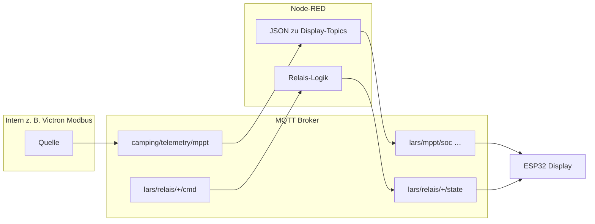
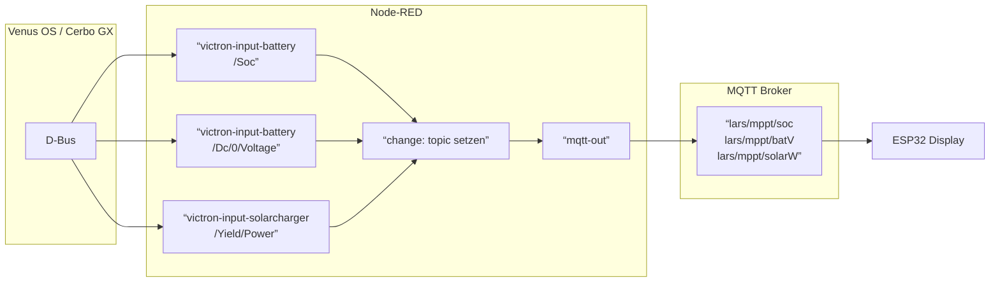

# Node-RED und MQTT – Best Practice für das Camping-Display

Die Firmware kann **zwei Wege** für MPPT/Batterie-Daten nutzen: (1) **ein JSON-Topic** (`TOPIC_TELEMETRY_JSON`, z. B. `camping/telemetry/mppt`) oder (2), wenn dieses Topic in `config.h` leer ist, **pro Messgröße ein eigenes Topic** mit **reinem Zahlentext** im Payload (`atof`), z. B. `"78.5"`. **Temperaturen** werden immer über die in `config.h` gesetzten **flachen** Temperatur-Topics geliefert (nicht aus dem MPPT-JSON). Relais-States verstehen zusätzlich `on`/`off`, `an`/`aus`, `1`/`0`.

Moderne Automation nutzt dagegen oft **ein JSON-Telegramm** (eine Quelle, Versionierung, klare Semantik). Empfohlen ist deshalb eine **zweistufige Architektur**:

1. **Intern (Broker / Node-RED):** strukturierte Topics und JSON-Payloads nach den Regeln unten.
2. **Adapter-Flow:** wandelt JSON (oder andere Quellen) in die **Display-Topics** aus `config.h` um.

So bleibt die Firmware schlank; du behältst trotzdem saubere Daten im Rest des Systems.

---

## Architektur-Skizze



---

## Topic- und Payload-Konventionen (Best Practice)

### 1. Namensräume versionieren

- Präfix pro System: z. B. `camping/` oder `bus/energy/`.
- Telemetrie von Befehlen trennen:
  - **State / Messwerte:** `…/telemetry/…` oder `…/state/…`
  - **Befehle:** `…/cmd/…` (nur schreiben, kurze Payloads)
- Optional Version im Pfad: `camping/telemetry/mppt/v1` – erleichtert spätere Breaking Changes.

### 2. JSON für Telemetrie

- **Content-Type:** in Node-RED `datatype: json` oder explizit UTF-8 JSON-String.
- **Ein Objekt pro logischer Einheit** (ein MPPT-Block statt sechs lose Zahlen-Topics), z. B.:

```json
{
  "schema": "camping.telemetry.mppt.v1",
  "ts": "2026-04-25T14:30:00.000Z",
  "soc": 78.5,
  "voltage": 13.12,
  "solar_w": 420,
  "current_a": 12.3,
  "load_w": 85
}
```

*(Kein `temp_*` im MPPT-JSON nötig fürs Display – Temperaturen laufen über die vier `camping/temp/…`-Topics.)*

- **`ts`:** ISO-8601 (UTC) – hilft bei Logging und Fehlersuche; die Firmware wertet es nicht aus.
- **Option `schema`:** erleichtert Validierung (JSON-Schema, switch im Flow).

### 3. QoS und Retain

| Art | Empfehlung | Begründung |
|-----|------------|------------|
| Live-Telemetrie (SOC, Leistung) | **QoS 0**, **retain false** | Keine veralteten „letzten Werte“ beim Subscribe; weniger Broker-Last. |
| Relais-**State** (Ist-Zustand) | **QoS 1**, **retain true** (optional) | Neues Display / Reconnect sieht sofort den letzten Zustand – nur wenn deine Logik konsistent `state` setzt. |
| **Befehle** (`…/cmd`) | **QoS 1**, **retain false** | Genau einmal ausführen; keine retained Commands. |

### 4. Relais-Befehle und Rückmeldung

- Display **sendet** auf `lars/relais/{1,2,3}/cmd` den konfigurierten Text (Standard: `toggle`).
- **Best Practice:** Node-RED empfängt den Befehl, schaltet die Last (GPIO, Shelly, Tasmota, …) und **publiziert den neuen Ist-Zustand** auf `lars/relais/{n}/state` mit stabiler Semantik, z. B. `on` / `off` oder `1` / `0`.

### 5. Sicherheit

- Broker nicht öffentlich; **MQTT-TLS** (Port 8883) und starke Passwörter, wenn WLAN unsicher ist.
- Getrennte MQTT-User für nur-Lesen (Display) vs. Schreib-Rechte (optional) – je nach Broker.

---

## Firmware-Zweig `feature/mqtt-json-telemetry`

Auf diesem Branch abonniert das Display **direkt** `TOPIC_TELEMETRY_JSON` (Standard: `camping/telemetry/mppt`) und parst **ein JSON-Objekt** pro Nachricht. Die flachen Topics `lars/mppt/soc` usw. werden dann **nicht** mehr abonniert (Rückfall: `TOPIC_TELEMETRY_JSON` in `config.h` auf `""` setzen).

**Unterstützte Felder** (alle optional; fehlende Keys lassen den bisherigen Wert / „--“):

| JSON-Schlüssel | Alternativ | → Anzeige |
|----------------|------------|-----------|
| `soc` | — | SOC % |
| `voltage` | `bat_v` | Spannung V |
| `solar_w` | `solarW` | Solar W |
| `current_a` | `batA` | Strom A |
| `load_w` | `loadW` | Last W |

**Hinweis:** Felder wie `temp_c` werden im JSON-Parser der Firmware **nicht** ausgewertet; Außen-/Innen-/Kühl-/Schrank-Temperatur kommen über `TOPIC_TEMP_*` (siehe `config.h`).

Max. Nutzlast ca. **767 Byte** (Puffer im Firmware-Callback). Nach **gültigem** JSON wird ein Vollbild nur ausgelöst, wenn sich mindestens ein Wert gegenüber dem zuletzt gezeichneten Stand um mindestens die jeweilige **Schwelle** (`DISPLAY_THRESHOLD_*`) ändert **und** der Mindestabstand `DATA_REFRESH_INTERVAL_MS` seit dem letzten Vollbild erreicht ist (siehe `main.cpp`).

---

## JSON → Display (Adapter)

**Nur nötig**, wenn das Display **ohne** natives JSON arbeitet (`TOPIC_TELEMETRY_JSON ""`): Die Firmware liest dann **kein** JSON auf `lars/mppt/*`. Der Adapter:

1. Abonniert z. B. `camping/telemetry/mppt` (oder `…/v1`).
2. Parst JSON und sendet **mehrere MQTT-Nachrichten** mit `msg.topic` + `msg.payload` als **String-Zahl** auf:
   - `lars/mppt/soc`
   - `lars/mppt/batV`
   - `lars/mppt/solarW`
   - optional dieselben Topic-Namen wie in `config.h` für Strom, Last, Temperatur, sobald dort Topics gesetzt sind.

Feld-Mapping (Vorschlag):

| JSON-Feld | Display-Topic |
|-----------|-----------------|
| `soc` | `lars/mppt/soc` |
| `voltage` oder `bat_v` | `lars/mppt/batV` |
| `solar_w` oder `solarW` | `lars/mppt/solarW` |
| `current_a` | `lars/mppt/batA` (nur wenn in `config.h` `TOPIC_CURRENT` gesetzt) |
| `load_w` | `lars/mppt/loadW` (wenn `TOPIC_LOAD_POWER` gesetzt) |
| *Temperaturfelder* | je nach Setup auf `camping/temp/aussen` usw. (wie `TOPIC_TEMP_*` in `config.h`) |

---

## Import der vorbereiteten Flows

1. Node-RED-Menü **Importieren** → Datei wählen: [`node-red/camping-display.json`](node-red/camping-display.json)
2. MQTT-Broker-Knoten **„mosquitto-local”** öffnen → Broker-IP/Host, Port, ggf. User/Passwort deines Mosquitto eintragen.
3. Tab deployen.

Enthaltene Bausteine (kurz):

| Flow-Bereich | Zweck |
|--------------|--------|
| **A – Telemetry JSON → Display** | MQTT-Topic mit JSON → flache `lars/mppt/*` (für Betrieb **ohne** natives JSON am ESP; sonst Gruppe A deaktivieren) |
| **A – Inject (Demo)** | Testwerte ohne echte Quelle |
| **B – Relais cmd** | `lars/relais/+/cmd` → Debug; simuliert Rückmeldung `…/state` (Beispiel) |
| **C – Victron Direct** | `node-red-contrib-victron`-Nodes → `lars/mppt/*` direkt (kein Umweg über JSON-Topic) |

**B** ist absichtlich minimal: echte Schaltaktoren hängst du an Stelle des Function-/Debug-Knotens.

---

## Gruppe C – node-red-contrib-victron (Cerbo GX / Venus OS)

Voraussetzung: [`node-red-contrib-victron`](https://github.com/victronenergy/node-red-contrib-victron) ist installiert und Node-RED läuft auf dem Venus-OS-Gerät (oder hat Netzwerkzugang dazu).

### Einrichtung

1. Flow importieren (siehe oben) – Gruppe C ist bereits enthalten.
2. Jeden `victron-input-*`-Node **doppelklicken** → im Dropdown **Gerät (Service)** auswählen. Die Pfade sind bereits voreingestellt:

| Node | Pfad | Display-Topic |
|------|------|---------------|
| `victron-input-battery` | `/Soc` | `lars/mppt/soc` |
| `victron-input-battery` | `/Dc/0/Voltage` | `lars/mppt/batV` |
| `victron-input-solarcharger` | `/Yield/Power` | `lars/mppt/solarW` |
| `victron-input-battery` | `/Dc/0/Current` | `lars/mppt/batA` *(optional)* |
| `victron-input-battery` | `/Dc/0/Temperature` | `lars/mppt/batTemp` *(optional)* |

3. Alle fünf Nodes zeigen nach der Gerätewahl einen grünen Status-Punkt.
4. **Gruppe A deaktivieren** (Rechtsklick auf Gruppe → Deaktivieren), damit `lars/mppt/*` nicht doppelt publiziert wird.
5. Deploy.

> **Optional:** Strom (`batA`) nur, wenn `TOPIC_CURRENT` in `config.h` gesetzt ist. **Temperaturen** kommen über die vier `TOPIC_TEMP_*` (Standard `camping/temp/…`); dafür eigene Victron- oder MQTT-Nodes auf diese Topics legen – die Tabelle oben nennt nur die MPPT-Zeilen.

### Architektur mit Victron-Integration



---

## Function-Code (Referenz, falls du manuell baust)

**JSON → mehrere MQTT-Out** (ein MQTT-Out-Knoten, Topic aus `msg.topic`):

```javascript
let j = msg.payload;
if (typeof j === 'string') {
  try { j = JSON.parse(j); } catch (e) { return null; }
}
if (!j || typeof j !== 'object') return null;

const publish = (topic, value) => {
  if (value === undefined || value === null || topic === '') return;
  const n = Number(value);
  if (Number.isNaN(n)) return;
  node.send({ topic, payload: String(n), qos: 0, retain: false });
};

publish('lars/mppt/soc', j.soc);
publish('lars/mppt/batV', j.voltage ?? j.bat_v);
publish('lars/mppt/solarW', j.solar_w ?? j.solarW);
// Optional – Topics müssen in config.h gleich lauten und nicht leer sein:
// publish('lars/mppt/batA', j.current_a);
// publish('lars/mppt/loadW', j.load_w);
// Temperaturen bei Bedarf auf TOPIC_TEMP_* aus config.h, z. B.:
// publish('camping/temp/aussen', j.temp_aussen);
return;
```

---

## Checkliste

- [ ] Broker erreichbar vom ESP32 (gleiches LAN/VPN).
- [ ] `config.h`: Entweder natives JSON (`TOPIC_TELEMETRY_JSON`) **oder** Adapter-Ziele `lars/mppt/…`; Temperatur-Topics wie in `config.h`.
- [ ] Relais: nach jedem Schalten `…/state` setzen, damit die Leiste stimmt.
- [ ] Telemetrie: **retain false**, damit nicht alte Werte „kleben“ bleiben (außer bewusst für State).

Bei Fragen zur Firmware-Seite siehe [`README.md`](README.md) und [`src/config.h`](src/config.h).
